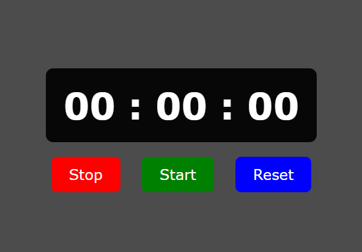

# ⏱️ Stopwatch Webapp

A simple and responsive **Stopwatch** built using **HTML, CSS, and JavaScript**.

---

## 🚀 Features

- 🟢 **Start** — Begins the stopwatch.  
- 🔴 **Stop** — Pauses the timer without resetting the time.  
- 🔁 **Reset** — Sets the time back to 00:00:00.

---

## 🖼️ Preview



---

## 🧠 How It Works

The JavaScript script uses the `setInterval()` function to increment milliseconds, seconds, and minutes.  
Button event listeners (`onclick`) control the flow:
- `Start`: Starts the timer loop.
- `Stop`: Clears the interval to pause.
- `Reset`: Clears the interval and resets time variables to zero.

---

## 🛠️ Technologies Used

| Technology | Badge |
|------------|-------|
| HTML      |  |
| CSS       |  |
| JavaScript |  |

---

## 📁 Project Structure

```
stop-watch/
│
├── index.html
├── style.css
├── script.js
└── screenshot.png
```

---

## 💡 Connect with Me

- [](https://www.linkedin.com/in/dineshsinghdhami1/) 
- [](https://github.com/dineshsinghdhami)

---

## ©️ Copyright

- All rights reserved © 2025 **[Dinesh Singh Dhami](https://www.dineshsinghdhami.com.np)**
- This project is licensed for personal and educational use.
- For commercial use or redistribution, please contact the owner.
